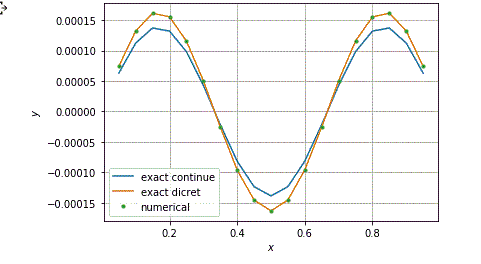
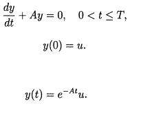

example of using a matrix exponent in solving
Cauchy's problem:

In the program, matrix A corresponds to the second difference derivative of
exact functions that vanish at the ends of the interval [0,1]. Exact
the solution of a discrete and continuous problem is represented as a decomposition
eigenfunctions
